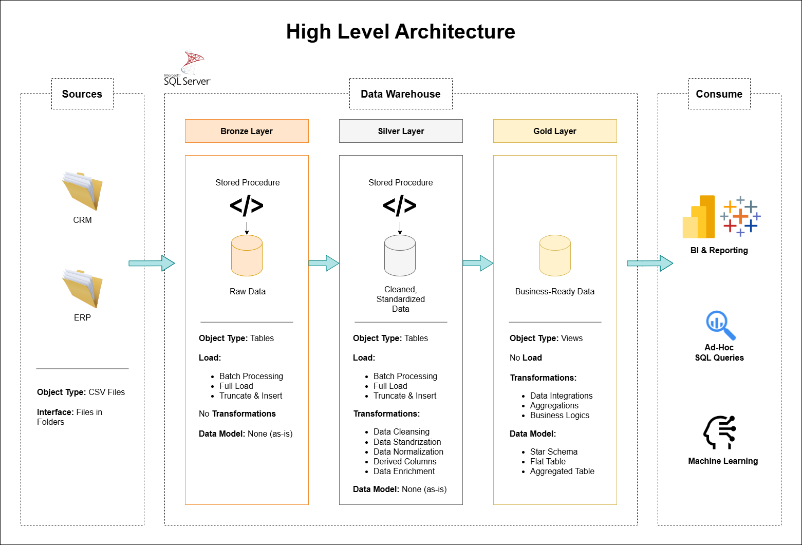

# Data Warehouse and Analytics Project

Welcome to my **Data Warehouse and Analytics Project** repository! 🚀

This project demonstrates a comprehensive data warehousing solution built with SQL Server, covering the full pipeline from raw data ingestion to business-ready analytics. It was completed as a guided project following the [SQL Data Warehouse Project](https://www.youtube.com/watch?v=9GVqKuTVANE) tutorial by [Data With Baraa](https://github.com/DataWithBaraa), with the goal of deepening my understanding of data engineering concepts and strengthening my portfolio.

👉 For the exploratory and reporting analysis built on top of this data warehouse, check out the [**data-analytics-project**](https://github.com/farhanfdlh/data-analytics-project) repository.

---

## 🏗️ Data Architecture

This project follows the **Medallion Architecture** with three layers: **Bronze**, **Silver**, and **Gold**.



1. **Bronze Layer** — Stores raw data as-is from the source systems. Data is ingested from CSV files into SQL Server using `BULK INSERT`.
2. **Silver Layer** — Applies data cleansing, standardization, and normalization to prepare data for analysis.
3. **Gold Layer** — Houses business-ready data modeled into a **Star Schema**, optimized for reporting and analytical queries.

---

## 📖 Project Overview

This project covers:

1. **Data Architecture** — Designing a modern data warehouse using Medallion Architecture.
2. **ETL Pipelines** — Extracting, transforming, and loading data from source systems into the warehouse using Stored Procedures.
3. **Data Modeling** — Developing fact and dimension tables optimized for analytical queries.
4. **Data Quality Checks** — Validating data integrity, consistency, and accuracy across all layers.
5. **Analytics & Reporting** — Creating SQL-based views and queries for actionable business insights.

---

## 🛠️ Tools & Technologies

| Tool | Purpose |
|---|---|
| SQL Server Express | Database engine |
| SQL Server Management Studio (SSMS) | Database GUI |
| Draw.io | Architecture & data flow diagrams |
| Git & GitHub | Version control |

---

## 🚀 Project Requirements

### Data Engineering

**Objective:** Build a modern data warehouse using SQL Server to consolidate sales data for analytical reporting.

**Specifications:**
- **Data Sources:** Two source systems — ERP and CRM — provided as CSV files.
- **Data Quality:** Cleanse and resolve data quality issues prior to analysis.
- **Integration:** Combine both sources into a unified data model designed for analytical queries.
- **Scope:** Focus on the latest dataset only; historization is not required.
- **Documentation:** Provide clear documentation of the data model for business and analytics stakeholders.

### BI: Analytics & Reporting

**Objective:** Develop SQL-based analytics to deliver insights into:
- Customer Behavior
- Product Performance
- Sales Trends

---

## 📂 Repository Structure

```
data-warehouse-project/
│
├── datasets/                           # Raw datasets (ERP and CRM CSV files)
│
├── docs/                               # Project documentation and architecture diagrams
│   ├── data_architecture.drawio        # Data architecture diagram
│   ├── data_flow.drawio                # Data flow diagram
│   ├── data_models.drawio              # Star schema / data model diagram
│   ├── data_catalog.md                 # Dataset catalog with field descriptions
│   ├── naming-conventions.md           # Naming conventions for tables, columns, and files
│
├── scripts/                            # SQL scripts for ETL and transformations
│   ├── bronze/                         # Scripts for raw data ingestion
│   ├── silver/                         # Scripts for data cleansing and transformation
│   ├── gold/                           # Scripts for analytical views (Star Schema)
│
├── tests/                              # Data quality check scripts
│
├── README.md                           # Project overview and instructions
├── LICENSE                             # License information
└── .gitignore                          # Files ignored by Git
```


---

## 🙏 Acknowledgements

This project was built by following the excellent tutorial by **Baraa Khatib Salkini (Data With Baraa)**:
- 📺 YouTube Tutorial: [SQL Data Warehouse Project](https://www.youtube.com/watch?v=9GVqKuTVANE)
- 💻 Original Repository: [DataWithBaraa/sql-data-warehouse-project](https://github.com/DataWithBaraa/sql-data-warehouse-project)

All credit for the project design, architecture, and teaching goes to the original author.

---

## 👤 About Me

**Farhan Fadhilah Rasyid**

A data enthusiast continuously learning and building projects in data engineering and analytics.

[](https://github.com/farhanfdlh)
[](https://www.linkedin.com/in/farhan-fadhilah-rasyid)
[](https://farhan-portfolio-smoky.vercel.app)

---

## 🛡️ License

This project is licensed under the [MIT License](LICENSE).
